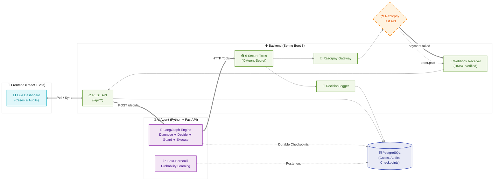
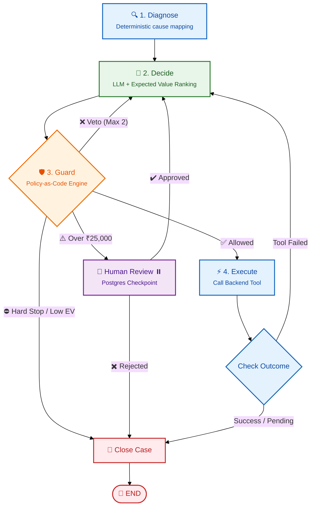
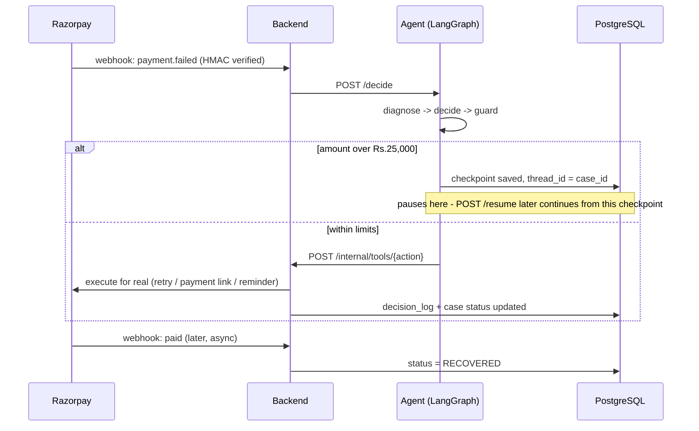

# AI Revenue Recovery Engine

> **Razorpay Hackathon · Track 03** — recovering revenue lost to failed payments by treating it as a **decision problem under uncertainty**, not a retry loop.

An autonomous agent that, for every failed payment, answers one question — *given why this specific payment failed, what is the single best next action, and is it even worth taking one?* — then executes it under **policy-as-code governance**, with a **human in the loop** for high-value cases and **every decision on an audit trail**.

<p>


</p>

---

## TL;DR — the result

On 300 synthetic failed payments (₹23.5L at risk, deterministic replay, seed 42):

| Strategy | Recovered | % of ceiling | Payment attempts | Customer contacts |
|---|--:|--:|--:|--:|
| Do nothing | ₹0 | 0% | 0 | 0 |
| Naive (retry ×3 always) | ₹4,65,450 | 30% | 770 | 0 |
| **This agent** | **₹15,36,967** | **99.7%** | **316** | 254 |
| Oracle (reads the answer key) | ₹15,41,589 | 100% | 125 | 52 |

**3.3× the recovery of naive retrying, with less than half the payment attempts** — and it abandons hopeless cases with a *logged reason* instead of hammering the gateway. It reaches 99.7% of a player that can see the hidden answer key.

---

## The problem

When a payment fails, most systems do one of two things: nothing, or blindly retry on a cron until it works or the customer churns. Both treat every failure identically — but *"insufficient funds"*, *"expired card"*, and *"gateway timed out"* are completely different problems. Retrying an expired card three times recovers nothing; it just burns processor fees and trains the customer to ignore you.

Recovery is really a **portfolio decision**: which rupees to chase, with which action, and when to stop. That framing is the whole project. Everything else is the infrastructure that lets an agent make that decision *safely*.

---

## Architecture

Three services, and the split between them is the core design decision: **the thing that reasons and the thing that acts are separate processes.**

### High-Level Design (HLD)

The architecture is deliberately split into three layers: **The thing that reasons (Python)** and **The thing that acts (Java).**

**The 4-Step Workflow (How to explain it):**
1. **Catch & Store (Spring Boot Backend):** Razorpay sends a `payment.failed` webhook. The Java backend securely verifies the HMAC signature, safely stores the case in PostgreSQL, and asks the Python Agent for advice.
2. **Brain & Logic (Python + LangGraph):** The Agent operates as a state machine. It maps the error to a root cause, mathematically calculates which recovery action has the highest Expected Value (EV), and uses Google Gemini to rank the best options.
3. **Governance (Policy-as-Code):** Before any action is taken, a strict rules engine checks `policy.yaml`. If it's during quiet hours (late at night) or violates retry limits, it is blocked. If the failure involves over ₹25,000, the AI entirely pauses and waits for Human Approval. 
4. **Execution (Internal Tools):** If approved, the agent tells the Java backend which tool to run. The Java backend safely calls Razorpay to generate a fresh Payment Link or Retry Order. The React frontend renders this entire timeline instantly.



### The AI Decision Graph (LLD)



**How to explain the 4 LangGraph Nodes:**
*   **Diagnose:** Maps Razorpay's exact error code (e.g. `card_declined`) to a deterministic category (e.g. `HARD_DECLINE`). This prevents LLM hallucinations.
*   **Decide:** Ranks every possible action by Expected Value (Predicted Success Rate × Amount).
*   **Guard:** The Policy-as-Code gatekeeper. Even if the AI ranks an action highly, Guard has the final veto.
*   **Execute:** The only node permitted to trigger real-world consequences via the Backend's authenticated tools.

---

## Low-Level Design (LLD)

One sequence for the whole lifecycle, plus the essentials in three compact tables.



| Data model | What it holds |
|---|---|
| `recovery_case` | one row per failure — status, amount, diagnosis, recovered_paise |
| `decision_log` | append-only audit trail, one row per graph node run |
| `ev_stats` | Beta-Bernoulli learning: `(cause, action) → alpha, beta` |

| Guard verdict | Trigger | Result |
|---|---|---|
| `needs_approval` | amount over ₹25,000 | pause for a human, durable via Postgres checkpoint |
| `hard_stop` | customer opted out, or loop budget exhausted | close immediately, no more tries |
| veto | per-action limit hit (attempts / contacts / quiet hours) | exclude that action, try the next-best |
| `allowed` | none of the above | proceed to execute |

Agent's entire reach into the real world — six tools, all behind `X-Agent-Secret`: `retry-payment`, `schedule-retry`, `create-payment-link`, `send-reminder`, `escalate`, `close-case`.

## Key engineering decisions

The parts I'd want to talk through in an interview:

1. **Reasoning and acting are different processes.** The agent can't touch the database or Razorpay; it can only call six authenticated tools. Security by architecture, not by prompt.
2. **Expected value is the decision-maker; the LLM is a ranker.** The system is *correct even when the model is down* — a Gemini outage falls back to the deterministic EV ranking and logs that it did. (This literally happened during development and the agent kept recovering money.)
3. **Governance is policy-as-code, not instructions.** Every hard limit lives in `policy.yaml`, enforced by the backend. You can change policy without touching code, and no amount of clever prompting gets the agent past it.
4. **Human-in-the-loop that survives a crash.** High-value cases pause on a durable Postgres checkpoint — kill the process, restart it, the case is still waiting for approval.
5. **The benchmark is a deterministic replay, on purpose.** Comparing four strategies is only fair if all four face an identical world; randomness would measure luck. The *real-time* path (live Razorpay webhooks) is separate and demonstrated.
6. **Honest measurement.** The headline number is qualified in the README itself (see limitations) — the differentiator is cost-efficiency, and the code says so.

---

## Results in detail

Total at risk: **₹23,53,507**. Reproduce with a single command (see below).

**It learns** — Beta-Bernoulli posteriors update during the run. Recovery stays flat; wasted outreach drops **25%** as the agent prunes actions whose true success rate is near zero:

| Cases | Recovered | Contacts per ₹10k recovered |
|---|--:|--:|
| 1–100 | 59 | 1.93 |
| 101–200 | 59 | 1.64 |
| 201–300 | 55 | **1.45** |

**Governance during the run:** 26 escalations (every case above ₹25,000 paused for a human), 180 stopping-rule activations (guard vetoes + EV-abandonment closes), and all 6 opted-out customers left completely untouched (0 actions). Full breakdown per failure cause: [`eval/results.md`](eval/results.md).

---

## Tech stack

| Layer | Stack |
|---|---|
| **Agent** | Python 3.11, FastAPI, **LangGraph** state machine, Gemini (temperature 0, JSON-only) with deterministic fallback, Beta-Bernoulli learning, `PostgresSaver` checkpoints |
| **Backend** | Java 17, **Spring Boot 3.3**, Flyway migrations, HikariCP, JPA, Razorpay REST integration, HMAC-SHA256 webhook verification |
| **Frontend** | React + Vite, Tailwind, Recharts, dark mode |
| **Data** | PostgreSQL — cases, `decision_log`, `ev_stats`, LangGraph checkpoints |
| **Quality** | 46 pytest tests + JUnit, deterministic seeded fixtures, one-command CI (`ci/verify.sh`) |

---

## Run it

```bash
cp .env.example .env          # all config is environment-only; no secrets in code
docker compose up --build
# frontend  http://localhost:5173
# backend   http://localhost:8080/api/health   (port via SERVER_PORT)
# agent     http://localhost:8000/health
```

**Reproduce the benchmark** (regenerates `eval/results.md` + `/api/metrics`):

```bash
java -jar backend/target/recovery-backend-0.1.0.jar \
  --recovery.batch.enabled=true --recovery.batch.include-agent=true
```

**Live Razorpay test mode** (real API, real webhooks, no real money): see [`docs/razorpay-manual.md`](docs/razorpay-manual.md).

---

## Testing

46 Python tests + JUnit, covering the parts that actually matter:

- the full 300-case graph loop against a mock backend
- every guardrail (caps, quiet hours, opt-out, escalation line)
- the LLM chooser including *every* fallback path (bad reply, API error, no key)
- human-in-the-loop **restart survival** (pause, kill, resume from checkpoint)
- live-mode PENDING semantics (an action initiated ≠ money recovered)
- webhook **HMAC verification over raw bytes** — with a test proving re-serialized-but-equal JSON is rejected

```bash
cd agent && python -m pytest tests/      # 46 tests
cd backend && mvn test                   # JUnit (signature verifier)
bash ci/verify.sh                        # everything, what CI runs
```

---

## Security

- Webhook HMAC-SHA256 verified against the **raw request body bytes** (never re-serialized JSON), constant-time compare, 401 on mismatch — with a unit test proving a re-serialized-but-identical payload fails.
- `/internal/tools/**` requires `X-Agent-Secret` (constant-time check) and has no CORS mapping; public CORS covers `/api/**` only.
- All secrets are environment-only; none appear in any file or log. Live keys are refused unless prefixed `rzp_test_`.

---

## Reproducibility

Everything is seeded and pinned: the case generator (seed 42, exact distribution), the simulator (an action succeeds *iff* it equals `ground_truth.recovers_if`), the LLM (temperature 0 + deterministic fallback), the batch clock (fixed noon IST so quiet-hours never flap), and the learning table (reset to priors before each AGENT run). **Two runs produce the same numbers.**

---

## Honest limitations

Kept in the README on purpose — knowing what your numbers *don't* prove is the point.

- **The simulator is deterministic and single-shot.** One action recovers each case; real outcomes are stochastic and time-dependent. That's why recovery reaches 99.7% of oracle — it's near-exhaustible. **The truer differentiator is efficiency:** the agent spends ~5× the oracle's contacts, and that gap — not the recovery headline — is what the learning system narrows.
- **Priors are hand-set near the generator's truth**, so learning shows up mostly as pruning genuinely-useless actions. With mis-specified priors it would matter more.
- **The LLM adds judgment, not magic.** With clean EV rankings the deterministic fallback picks the same action most of the time; the LLM earns its place on tie-breaks and customer context — and the batch runs identically without an API key, by design.
- **Live mode is demonstrated, not hardened:** no retry/backoff on Razorpay calls, single-instance scheduler, no idempotency keys on order creation, webhook replay handled only by payment-id dedupe.
- **One merchant, one currency, no dashboard auth** — explicitly out of scope for the hackathon.

---

## Repository map

```
agent/       LangGraph decision graph, EV + learning, policy.yaml, 46 tests
backend/     Spring Boot: API, tools, gateway, webhook, batch runner, migrations
frontend/    React dashboard — cases, decision timeline, approvals
data/        seeded case generator + 300-case dataset (ground truth)
eval/        verified benchmark results
docs/        architecture, live-demo, simulation write-ups
scripts/     live-proof + demo tooling (webhook harness, dry-run, benchmark)
ci/          one-command verification
```
